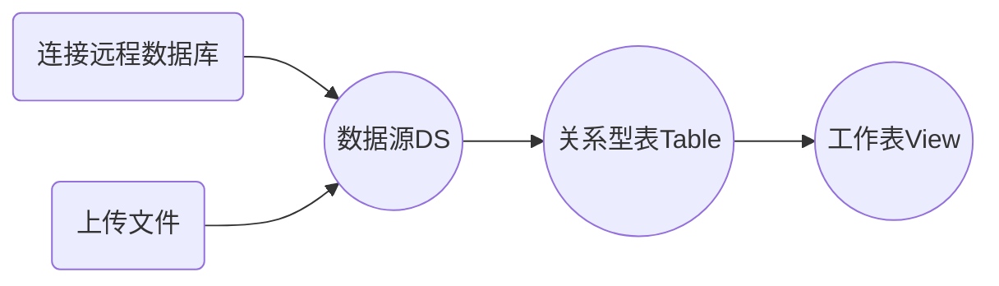

[TOC]


# 一、概述

这里所有**API**，是关于建立系统与用户**数据源绑定**的接口。目的是将用户提供的**各种类型数据源进行持久化操作**，最后表现结果为**建立工作表。**


数据源类型大致分两种:

1. 关系数据源DBMS（以Msyql为例）
2. 文件数据源（以Excel为例）


**文件类型**的数据源绑定，需要多一步对文件源的持久化操作。也就是说需要用户上传**数据文件**。


对于用户的接口调用次序

## DBMS数据源


## 文件数据源


## 实体




# 二、APIs

> 1.0


- [x] /uploadExcelFile

- [x] /saveDataSource

- [x] /getAllDataSource

- [x] /getAllTables

- [x] /dataPreview

- [x] /saveView

- [x] /deleteViewByID

- [x] /deleteDataSource

- [ ] /uploadCSVFile

- [ ] /uploadTxtFile

  


## 1、上传文件

### /uploadExcelFile

`method`:post

概述：上传用户的Excel文件。

#### 载荷（推送参数）:

| 字段     | 备注                       |
| -------- | -------------------------- |
| filename | 文件名（以当前时间为名字） |
| file     | 文件（二进制数据）         |

#### 响应：

| 字段     | 备注                     |
| -------- | ------------------------ |
| filename | 上传成功后，返回该文件名 |


## 2、保存数据源

### /saveDataSource

`method`:post

概述：保存用户选择的数据源（关系数据库/文件）。

#### 载荷：

| 字段     | 备注                            |
| -------- | ------------------------------- |
| DSID     | 数据源ID                        |
| DSName   | 数据源名                        |
| DSType   | 数据源类型（Mysql \| Excel \|） |
| dbinfo   | 数据源数据对象                  |
| UserName | 用户名（系统当前登录的用户）    |

> **dbinfo**详解

如果是保存**文本型**的数据源：

| 字段     | 备注   |
| -------- | ------ |
| filename | 文件名 |

如果是保存**关系数据库**：

| 字段     | 备注       |
| -------- | ---------- |
| server   | 数据库地址 |
| port     | 数据库端口 |
| userName | 数据库用户 |
| pwd      | 数据库密码 |
| database | schema名   |


#### 响应：

顶层：

| 字段 | 备注                           |
| ---- | ------------------------------ |
| msg  | 消息（ 例如，"保存成功！"）    |
| data | 数据对象，具体来说是一个DS对象 |

data层：

| 字段     | 备注           |
| -------- | -------------- |
| DSID     | 数据源ID       |
| DSName   | 数据源名       |
| DSType   | 数据源类型     |
| dbinfo   | 数据源数据对象 |
| UserName | 数据源所属用户 |


## 3、获取所有数据源

### /getAllDataSource

`method`：get

概述：获取当前用户拥有的所有数据源。

#### 载荷:

| 字段     | 备注                         |
| -------- | ---------------------------- |
| UserName | 用户名（系统当前登录的用户） |


#### 响应:

一个DS对象

| 字段     | 备注           |
| -------- | -------------- |
| DSID     | 数据源ID       |
| DSName   | 数据源名称     |
| DSType   | 数据源类型     |
| dbinfo   | 数据库信息     |
| UserName | 数据源所属用户 |


## 4、获取所有表

### /getAllTables

`method`：get

概述：根据**数据源ID**,获取当前数据源下面的所有表。（excel文件则是多个sheet）


#### 载荷:

| 字段     | 备注                         |
| -------- | ---------------------------- |
| DSID     | 数据源ID（Table所属数据源）  |
| UserName | 用户名（系统当前登录的用户） |


#### 响应:

| 字段 | 备注                                          |
| ---- | --------------------------------------------- |
| data | 表名数组（例如  [“table1”，“table2” ，....]） |

```json
{
    "data":[
        "table1",
        "table2",
        "table3"
    ]
}
```


## 5、数据预览

### /dataPreview

`method`：post

概述：通过传入sql语句的方式，预览当前关系型表的数据。


#### 载荷:

| 字段     | 备注                         |
| -------- | ---------------------------- |
| DSID     | 数据源ID                     |
| DSName   | 数据源名                     |
| DSType   | 数据源类型                   |
| sqlText  | sql语句                      |
| top      | 所展示数据条数（record数量） |
| UserName | 用户名（系统当前登录的用户） |


#### 响应:

| 字段      | 备注                  |
| --------- | --------------------- |
| data      | 结果集 （record数组） |
| columns   | 列名数组              |
| kpiFields | kpi字段数组           |


> kpi字段详解：将关系数据表的**字段**，按照**数据类型**进行分类。String类型归为**"dimension(维度)"**；数值类型归为**"measure(数值)”**。

kpiFields：

| 字段          | 备注                                                   |
| ------------- | ------------------------------------------------------ |
| filedName     | 关系型表中的字段名                                     |
| filedType     | 字段类型，按数据类型分两大类      dimension \| measure |
| filedDataType | 该字段的数据类型                                       |


响应示例：

```json
{
    "data": [
        {
            "姓名": "louis",
            "年龄": 21.0,
            "电话号码": 1231214.0
        },
        {
            "姓名": "kiki",
            "年龄": 48.0,
            "电话号码": 123124.0
        },
        {
            "姓名": "jack",
            "年龄": 78.0,
            "电话号码": 231241.0
        },
        {
            "姓名": "tom",
            "年龄": 69.0,
            "电话号码": 1321312.0
        },
        {
            "姓名": "kris",
            "年龄": 32.0,
            "电话号码": 3123124.0
        }
    ],
    "columns": [
        "姓名",
        "年龄",
        "电话号码"
    ],
    "kpiFields": [
        {
            "filedName": "姓名",
            "filedType": "dimension",
            "filedDataType": "String",
        },
        {
            "filedName": "年龄",
            "filedType": "measure",
            "filedDataType": "Double",
        },
        {
            "filedName": "电话号码",
            "filedType": "measure",
            "filedDataType": "Double",
        }
    ]
}
```


## 6、保存工作表

### /saveView

`method`：post

概述：保存通过执行sql产生的数据为一个**工作表**。

#### 载荷:

| 字段      | 备注                         |
| --------- | ---------------------------- |
| DSID      | 数据源ID                     |
| DSName    | 数据源名称                   |
| DSType    | 数据源类型                   |
| viewName  | 工作表名                     |
| kpiFields | 工作表字段集合               |
| sqlText   | sql语句（产生工作表的）      |
| UserName  | 用户名（系统当前登录的用户） |


#### 响应:

| 字段   | 备注                     |
| ------ | ------------------------ |
| viewID | 工作表ID                 |
| msg    | 消息反馈（“保存成功！”） |


## 7、删除工作表

### /deleteViewByID

`method`：delete

概述：通过工作表ID删除工作表

#### 载荷:

| 字段     | 备注                         |
| -------- | ---------------------------- |
| viewID   | 工作表ID                     |
| UserName | 用户名（系统当前登录的用户） |


#### 响应:

| 字段 | 备注                         |
| ---- | ---------------------------- |
| msg  | 操作反馈（例，“删除成功！”） |


## 8、删除数据源

### /deleteDataSource

`method`：delete

概述：通过数据源ID删除数据源

#### 载荷:

| 字段     | 备注                         |
| -------- | ---------------------------- |
| DSID     | 数据源ID                     |
| UserName | 用户名（系统当前登录的用户） |


#### 响应:

| 字段 | 备注                         |
| ---- | ---------------------------- |
| msg  | 操作反馈（例，“删除成功！”） |


> 弹性文档，不合理的地方，欢迎指出，可修改。
